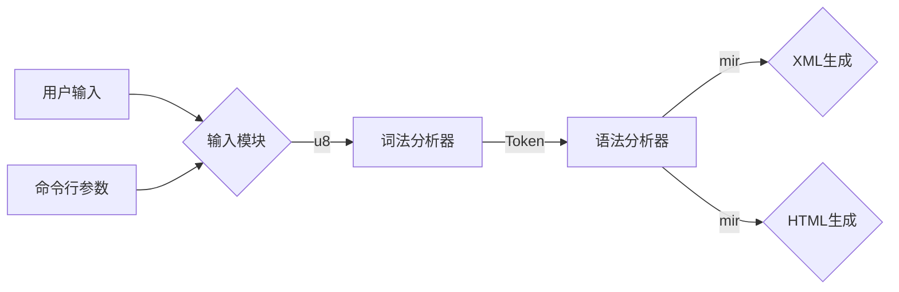
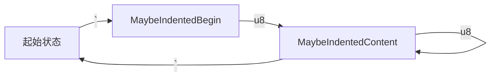

# Markdown语言语法分析软件

<div class="pt-12">
指导老师：陈墨

学生：柴博文

答辩时间：2023年6月5日
</div>

<!--
答辩老师好，同学们好。我是来自大数据1901的柴博文，我的毕设题目为：Markdown语言语法分析软件。下面我将从项目介绍、核心原理和技术设计这三方面来讲述本论文完成的内容。
-->

---
layout: default
---

# 目录

<Toc></Toc>

---
transition: slide-up
layout: center
class: text-center
---

# 项目介绍

## 随着现代工程对于Markdown的额外需求，原有的Markdown解析软件如Typora、Obsidian等前后端耦合的软件无法满足对于语法结果的额外需求。于是本项目将实现将Markdown的语法解析结果以XML或HTML等形式输出的软件。该软件采用了Zig语言编写，所生成软件为命令行程序，能够轻松的嵌入到无UI的服务器或者通过脚本进行调用。

---
transition: fade-in
---

## 实现成果

- 本毕业设计所完成的软件为命令行程序。

```
cat test.md | mdz -f=xml | from xml
```

这里通过NuShell来可视化展示XML


--- 
transition: slide-right
---

- 该程序将会将Markdown文件转换为XML或HTML。

<div grid="~ cols-2 gap-4">

<div grid="rows-2">


</div>


</div>

<style>
h1 {
  background-color: #2B90B6;
  background-image: linear-gradient(45deg, #4EC5D4 10%, #146b8c 20%);
  background-size: 100%;
  -webkit-background-clip: text;
  -moz-background-clip: text;
  -webkit-text-fill-color: transparent;
  -moz-text-fill-color: transparent;
}
</style>

<!--

-->

---
transition: fade-out
layout: center
class: text-center
---

## 执行流程



---

# 核心原理

为了实现语法分析，本项目采用了自动机来实现语法分析过程，本项目采用了DFA，它的数学表述为：

$$
(Q, \Sigma, \delta, q_0, F)
$$

其中我们需要实现$\delta$, 也就是状态转换函数。

<center>

</center>

上图展示了状态转换函数在处理行内代码时会进行的转换

---
---

# 技术设计:语法解析生成结果设计

在Markdown语言中，文字的装饰例如粗体、斜体、代码和LaTex等的嵌套在内存上的表述将会很复杂，所以本项目采用了`bitset`这一数据结构来简化文字的表述，并降低无装饰文字在内存中的占用:

```
    // 在AMD64平台上，为了保证在取内容的速度，这里编译器将会将char大小的bitset对齐到8，所以整体大小为16
    |0b00000000|{begin:0,end:12}|Normal
    |0b00000001|{begin:0,end:12}|Bold
    |0b00000010|{begin:0,end:12}|Italic
    |0b00000100|{begin:0,end:12}|StrikeThrough
    |0b00001000|{begin:0,end:12}|LaTex
    |0b00010000|{begin:0,end:12}|Code
```

相较于原本的嵌套结构，本结构减少了53%的内存占用，对于同样大小的Markdown，通过该结构，内存占用将只有之前的一半，意味着在相同的配置的服务器上，能够提高接近一半的峰值用户。

---
layout: center
class: text-center
---

# 请各位答辩老师指正

---
layout: center
class: text-center
---

# 感谢各位老师，同学
